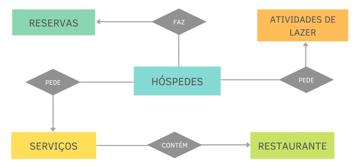
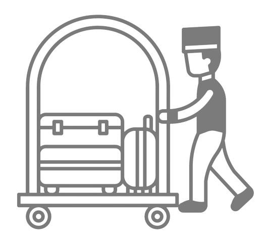
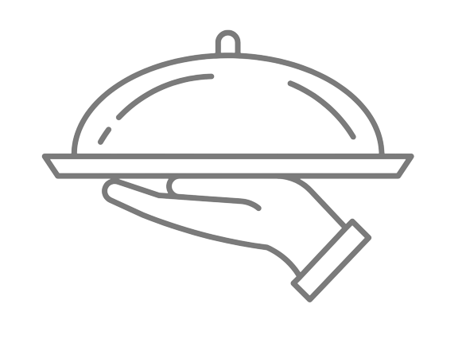

# API HOTEL 

<div id="inicio" align="center">
  <a href="#Projeto">Projeto  |</a>&nbsp;&nbsp;
  <a href="#Squad"> Squad  |</a>&nbsp;&nbsp;
  <a href="#modelagem-e-entidades"> Modelagem e Entidades |</a>&nbsp;&nbsp;
  <a href="#pré-requisitos"> Pré-requisitos  |</a>&nbsp;&nbsp;
  <a href="##packages"> Packages  |</a>&nbsp;&nbsp;
  <a href="#como-utilizar-a-api">Como usar a API</a>&nbsp;&nbsp;
</div>

<div align="center">
  <a href="#rotas-implementadas"> Rotas Implementadas  |</a>&nbsp;&nbsp;
   <a href="#hóspedes">Hóspedes    |</a>&nbsp;&nbsp;
    <a href="##reservas-1">Reservas  |</a>&nbsp;&nbsp;
     <a href="#lazer">Lazer  |</a>&nbsp;&nbsp;
      <a href="#servicos">Serviços  |</a>&nbsp;&nbsp;
       <a href="#restaurante">Restaurante  </a>&nbsp;&nbsp;
</div>


# Projeto


Como proposta de Projeto de final de módulo fomos escalados para desenvolver uma API que será o produto viável de um aplicativo.<br>
Definimos quais são as entidades que o projeto precisa contemplar e implementamos utilizando o **CRUD** e a arquitetura do projeto em **MVC**. 

**Curso:** Web Dev FullStack <br> 
**Instituição:** Resilia Educação <br>
**Projeto:** Final - Módulo 4 <br>


### Squad 

<table>
  <tr>
    <td align="center"  width="180px;"> <br>
      
       <h4>Edson Vieira</h4> 
       <a href="https://github.com/Edson-7728">
          
       </a>
       <a href="https://www.linkedin.com/in/edson-vieira7728/">
          
       </a>
    </td>   
    <td align="center" width="180px;"> <br>
    
      <h4>Élica Dias</h4>
       <a href="https://github.com/elicadv">
          
       </a>
       <a href="https://www.linkedin.com/in/%C3%A9lica-dias-a4989116b/">
               
       </a>
    </td>   
    <td align="center" width="180px;">  <br>
      
      <h4>Rachelle Santolin</h4>
      <a href="https://github.com/rachellesdev">
         
      </a>
      <a href="https://www.linkedin.com/in/rachelle-santolin/">
                
      </a>
    </td>   
    <td align="center" width="180px;"> <br>
    
        <h4>Rosana Ribeiro</h4>
          <a href="https://github.com/rosana-ctrl">
      
      </a>
      <a href="https://www.linkedin.com/in/rosana-ribeiro-39364a35/">
               
      </a>
    </td>
    <td align="center" width="180px;"> <br>
    
    <h4>Sara Lirio</h4>
      <a href="https://github.com/Sara-Lirio">
   
      </a>
      <a href="https://www.linkedin.com/in/saralirio/">
               
      </a>
    </td>
    </tr>
    </table>

## Modelagem e Entidades


Modelagem para visualização das relações das entidades para construção da API referente ao Hotel

 
<table>
  <tr>
    <td align="center"  width="180px;"> 
    
       <h4>Atividades de Lazer</h4> 
    </td>   
    <td align="center" width="180px;"> 
       
      <h4>Restaurante</h4>
    </td>   
    <td align="center" width="180px;">  
      
      <h4>Hóspedes</h4>
    </td>   
    <td align="center" width="180px;"> 
    
        <h4>Serviços</h4>
    </td>
    <td align="center" width="180px;"> 
    
    <h4>Reservas</h4>
    </td>
    </tr>
    </table>

## Pré-requisitos
`Node.js` <sup> v.16.15.1 </sup><br>
`NPM` <sup>v.8.11.0 </sup><br>

## Packages
`Express`<br>
`Nodemon`<br>
`SQLite`<br>
`Jest`<br>
`Super Test`

# Como utilizar a API
## Instalação da Aplicação

Abra o terminal/Powershell e rode os comandos abaixo:

Clonando o repositório:
```
git clone https://github.com/rosana-ctrl/projeto_final_m4.git
```

Entrando na pasta:
```
cd projeto_final_m4
```

Instalando os pacotes:
```
npm install
```

Rodando o projeto:
```
npm start ou npm run dev 
```

## Rotas Implementadas

### Hóspede
* __GET `/hospede`__ <sup>Pega todos os hóspedes adicionado</sup>

* __GET `/hospede/email/:email`__ <sup>Seleciona apenas um hóspede</sup>

* __POST `/hospede`__ <sup>Adiciona um novo hóspede</sup>

* __DELETE `/hospede/email/:email`__ <sup>Deleta apenas um hóspede</sup>

* __PUT `/hospede/email/:email`__ <sup>Atualiza apenas um hóspede</sup>

### Reservas
* __GET `/reservas`__ <sup>Pega todas as reservas realizadas</sup>

* __GET `/reservas/quarto/:quarto`__ <sup>Seleciona apenas uma reserva</sup>

* __POST `/reservas`__ <sup>Adiciona uma nova reserva</sup>

* __DELETE `/reservas/quarto/:quarto`__ <sup>Deleta apenas uma reserva</sup>

* __PUT `/reservas/quarto/:quarto`__ <sup>Atualiza apenas uma reserva</sup>


### Lazer
* __GET `/lazer`__ <sup>Pega todas as atividades agendadas</sup>

* __GET `/lazer/atividades/:atividade`__ <sup>Seleciona uma atividade pelo nome da atividade</sup>

* __GET `/lazer/atividades/:hospede`__ <sup>Seleciona uma atividade pelo nome do hóspede</sup>

* __GET `/lazer/atividades/:data`__ <sup>Seleciona uma atividade pelo dia que está agendada</sup>

* __POST `/lazer`__ <sup>Adiciona uma nova atividade</sup>

* __DELETE `/lazer/atividades/:atividade`__ <sup>Deleta uma atividade</sup>

* __PUT `/lazer/atividades/:atividade`__ <sup>Atualiza uma atividade</sup>


### Servicos
* __GET `/servicos`__ <sup>Pega todos os servicos realizados/sup>

* __GET `/servico/id/:id`__ <sup>Seleciona apenas um servico pelo id na URL</sup>

* __POST `/servicos`__ <sup>Adiciona um novo servico</sup>

* __DELETE `/servicos/id/:id`__ <sup>Deleta apenas um servico pelo id na URL</sup>

* __PUT `/servicos/id/:id`__ <sup>Atualiza apenas um servico pelo id na URL</sup>

